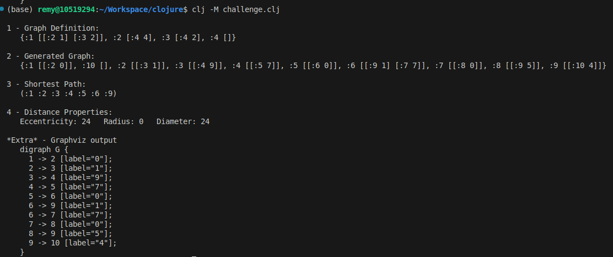

# Graph Challenge in Clojure by Remy

## Overview

This project involves creating and manipulating directed graphs in Clojure. The primary objectives are to implement a graph structure that supports random edge generation while ensuring connectivity, and to calculate various properties such as eccentricity and radius.
**Note**: The use of AI tools and resources was encouraged throughout this project to enhance development and improve efficiency.

## Features

- Generate a directed graph with a specified number of vertices and edges.
- Ensure that the graph remains connected.
- Calculate the shortest path between vertices using Dijkstra's algorithm.
- Compute the eccentricity, radius and diameter of the graph.

## Script output: 

## Functions

### `make-graph [n s]`

Generates a directed graph with `n` vertices and `s` edges. The graph is guaranteed to be connected. Each vertex is represented as a keyword.

**Parameters:**
- `n`: The number of vertices in the graph.
- `s`: The desired number of edges.

**Returns:**
- A sorted map representing the graph.

### `shortest-path [graph start end]`

Calculates the shortest path from a starting vertex to an ending vertex using Dijkstra's algorithm.

**Parameters:**
- `graph`: The graph structure.
- `start`: The starting vertex.
- `end`: The target vertex.

**Returns:**
- A map containing the distances from the start vertex and the path taken.

### `total-path-weight [graph path]`

Calculates the total weight of a given path in the graph.

**Parameters:**
- `graph`: The graph structure.
- `path`: A list of vertices representing the path.

**Returns:**
- The total weight of the path.

### `eccentricity [graph vertex]`

Calculates the eccentricity of a given vertex, defined as the maximum distance from that vertex to any other reachable vertex.

**Parameters:**
- `graph`: The graph structure.
- `vertex`: The vertex for which to calculate the eccentricity.

**Returns:**
- The eccentricity of the vertex.

### `radius [graph]`

Calculates the radius of the graph, defined as the minimum eccentricity of all vertices.

**Parameters:**
- `graph`: The graph structure.

**Returns:**
- The radius of the graph.

### `diameter [graph]`

Calculates the diameter of the graph, defined as the maximum eccentricity of any vertex in the graph.

**Parameters:**
- `graph`: The graph structure.

**Returns:**
- The diameter of the graph.

### `graph-to-dot [graph]`

Converts the graph structure into Graphviz DOT format for visualization.

**Parameters:**
- `graph`: The graph structure.

**Returns:**
- A string in Graphviz DOT format.

*This README file was generated with AI ;-)*